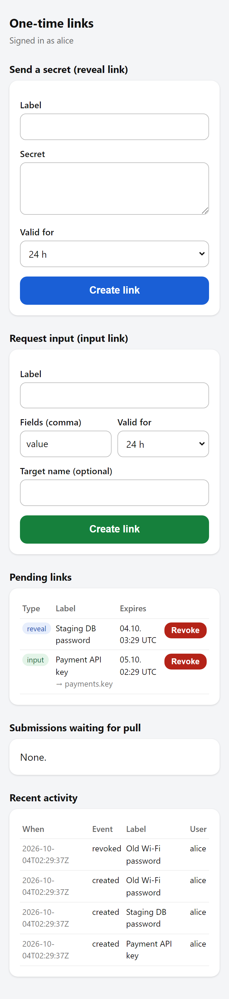
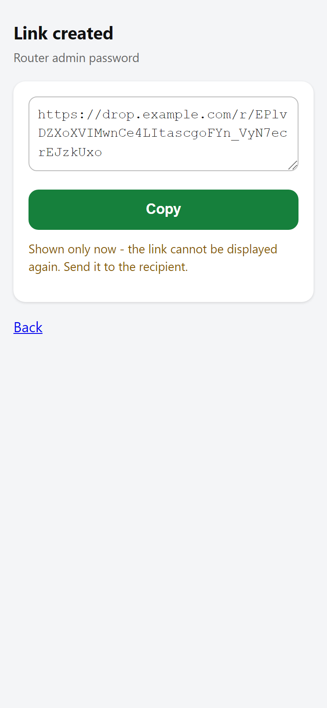
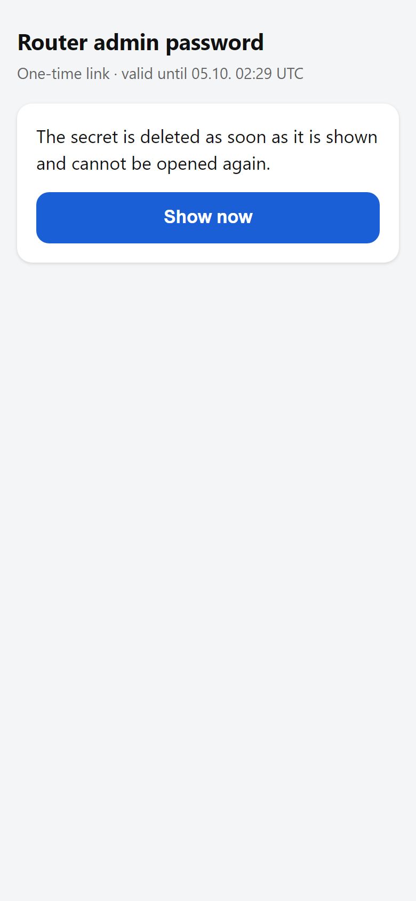
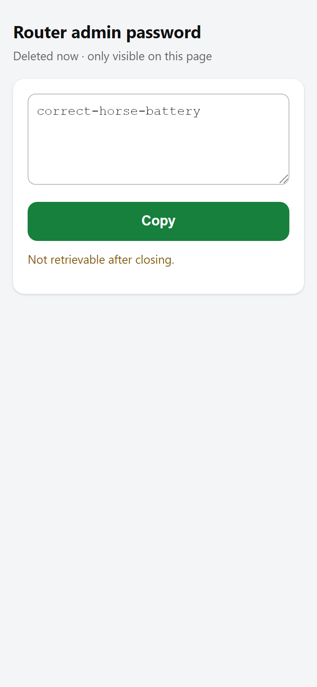
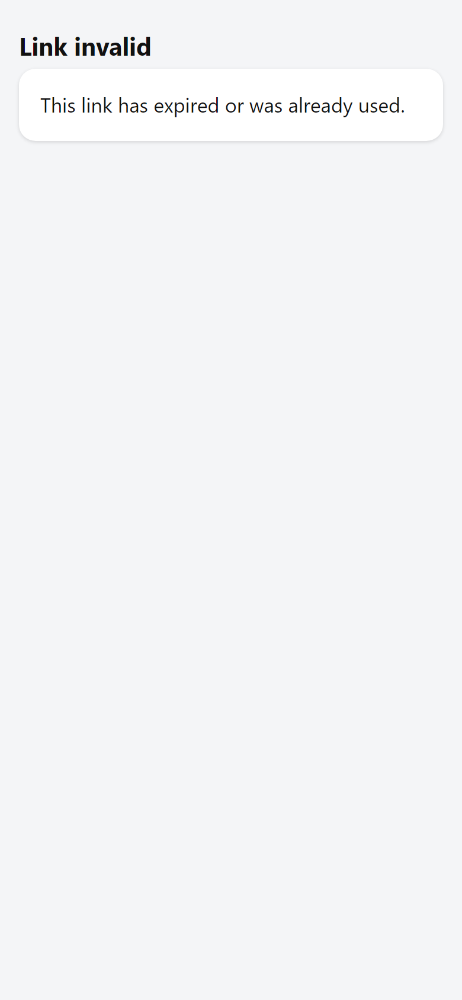
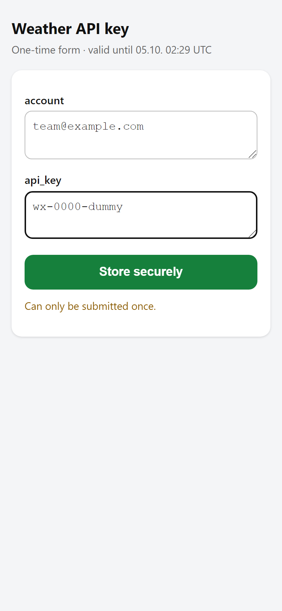
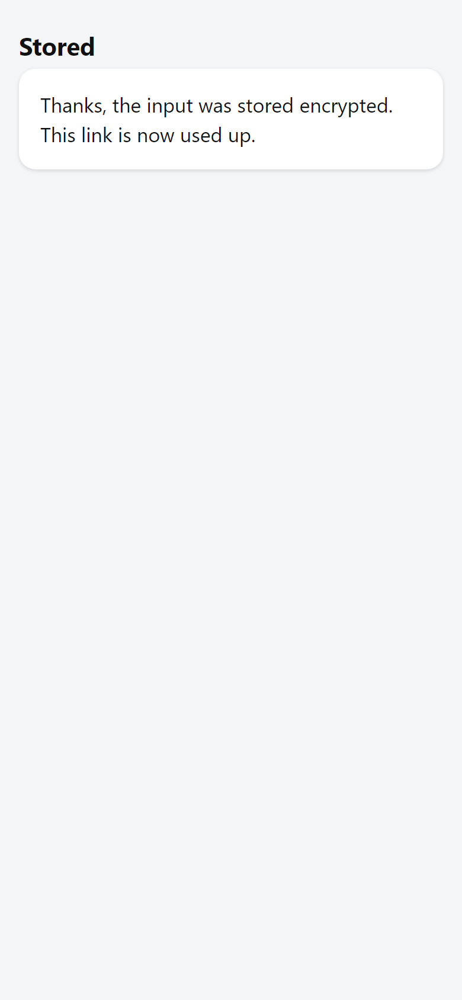
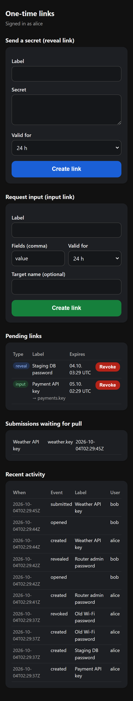

# onetime-drop

**Share secrets once, in both directions, behind your own SSO.** onetime-drop is a tiny
self-hosted service (Python stdlib + AES-256-GCM, no database, no JavaScript framework) for
sending a secret to someone, asking someone for a secret, or letting someone run one reviewed
privileged action - each through a link that works exactly once and is only usable by people
who sign in through your forward-auth reverse proxy (Traefik + Authelia, or anything that sets
a trusted `Remote-User` header).

**Features**

- **Reveal links** – send a secret (password, recovery code, ...) to someone. The page shows a
  confirm button; the secret is decrypted and deleted only on that **POST**, so link previews,
  chat unfurlers and browser prefetch cannot burn it. Mobile-friendly with a *Copy* button.
- **Input links** – *request* a secret from someone. They get a small one-time form (CSRF
  protected); the submission is stored encrypted in an outbox until you pull it to a target
  directory with a small pull tool.
- **Action links** – let someone run *one* reviewed, privileged action that needs a secret only
  they know (e.g. "install this SSH key on my device with the root password I type"). The page
  shows exactly what will run, they type the secret, press *Run* and watch the output live.
  See [Action links](#action-links).

Small on purpose: Python stdlib HTTP server + `cryptography`, file storage, easy to audit.

Jump to: [Quick install](#quick-install) | [Install with an AI assistant](#install-with-an-ai-assistant) | [Action links](#action-links) | [Security model](#security-model)

| Admin page | Link created | Recipient confirms | Revealed |
|---|---|---|---|
|  |  |  |  |

| Used link | Input form | Input stored | Dark mode |
|---|---|---|---|
|  |  |  |  |

Screenshots are rendered by `tools/screenshots.py` against a throw-away local instance with
dummy data.

## Scenarios

- **Send a password to a phone.** You are at a terminal, the other person only has a phone:
  `read -rs PW && printf %s "$PW" | onetime-drop create-reveal --label "Router admin"; unset PW`
  (or `< secretfile`) and send the URL by chat.
  The chat app's link preview fetches the page (GET) – that does not burn it. The recipient
  signs in through your SSO, taps *Show now*, taps *Copy*. The link is dead afterwards.
- **Request an API key from someone.** Create an input link with fields `account,api_key` and a
  target name `weather.key`. They paste the key into the form once. On your workstation
  `tools/pull_inputs.py` fetches it into `~/secrets/inbox/weather.key_<timestamp>.md` (owner-only
  permissions) and deletes it from the server.
- **Without a CLI.** Everything above is also available in the admin web page (`/admin`):
  create reveal and input links, see pending links, the pull queue and recent activity
  (never secret content), and revoke links.
- **Automation.** An agent or script can create links via the CLI and pull inputs via the pull
  tool; humans only ever see a link.

## How it differs from existing tools

Comparison to the well-known projects, to the best of our knowledge at the time of writing –
check their current docs, they evolve:

| | onetime-drop | Typical alternatives (Yopass, PrivateBin, OneTimeSecret, Hemmelig, Password Pusher) |
|---|---|---|
| Direction | reveal **and** input/request links | primarily reveal; some (e.g. Password Pusher, OneTimeSecret) also offer request/incoming features |
| Auth | relies on your existing SSO (forward-auth, 2FA); only listed users can open links | typically link-only access, often with optional accounts/passphrases |
| Burn trigger | explicit POST after a confirm page (prefetch/preview safe) | differs per project and settings |
| Inputs | land in an encrypted outbox, pulled to a target dir by a pluggable tool | where available, usually viewed inside the app |
| Crypto | server-side AES-256-GCM, key on the host | several (e.g. Yopass, PrivateBin) encrypt in the browser |
| Footprint | single small Python service, file storage | ranges from small to multi-component setups |

If you need **anonymous** recipients or **zero-knowledge** (browser-side) encryption, use Yopass,
PrivateBin or Hemmelig. onetime-drop is for "my own people, behind my own SSO, both directions".

## Quick install

Debian/Ubuntu with systemd, as a user with sudo:

```sh
git clone https://github.com/WaldemarFech/onetime-drop.git && cd onetime-drop
sudo sh deploy/install.sh                    # service user, dirs, key, proxy secret, unit (not started yet)
sudoedit /etc/onetime-drop/config.toml       # base_url, bind, allowed_proxies, allowed_users, admin_users
sudo cat /etc/onetime-drop/proxy_secret      # put this value into your proxy as X-Drop-Proxy-Secret
sudo systemctl start onetime-drop
systemctl is-active onetime-drop             # -> active
sudo journalctl -u onetime-drop -n 20 --no-pager
curl -s -o /dev/null -w '%{http_code}
' http://127.0.0.1:8080/admin   # -> 403 (not from the proxy: access control works)
```

Then configure the reverse proxy and SSO (below) and open `https://<your-domain>/admin`.
(Use the `bind`/`port` from your config in the curl check.)

`deploy/install.sh` is idempotent and never overwrites an existing config, key or proxy secret.
Requires Python >= 3.11 and `python3-cryptography`.

### Configuration

See [`deploy/config.example.toml`](deploy/config.example.toml). Key settings:

- `base_url` – public URL used in generated links
- `bind` / `port` – listen on the internal interface only
- `allowed_proxies` – source IP(s) of the reverse proxy; everything else gets 403
- `proxy_secret_file` – shared secret the proxy adds as `X-Drop-Proxy-Secret`
- `allowed_users` / `admin_users` – who may open links / use `/admin`
- `default_ttl`, `max_ttl` (cap 7 days), `lang` (`en` or `de`)

### Reverse proxy and SSO

- Traefik: [`deploy/traefik.example.yaml`](deploy/traefik.example.yaml). Middleware order matters:
  **scrub** client-supplied identity headers → **forward-auth** → **strip cookie + add proxy
  secret**.
- Authelia: [`deploy/authelia.example.yml`](deploy/authelia.example.yml) – `two_factor` for the
  allowed users, `deny` for everyone else.
- Any other forward-auth proxy works if it (1) removes client-sent `Remote-User`, (2) sets it
  after authentication and (3) adds the proxy secret header.

## Install with an AI assistant

Paste this into an AI coding agent (Claude Code or similar) that has shell access to your server:

````text
Install onetime-drop (https://github.com/WaldemarFech/onetime-drop) on this Debian/Ubuntu
server with systemd. Read the repository README, deploy/install.sh, deploy/config.example.toml
and the security model before changing anything, and follow these rules:

1. Ask me first, and wait for my answers: (a) the public domain/base URL for the service,
   (b) which reverse proxy I use (Traefik, nginx, Caddy, ...) and where its config lives,
   (c) which SSO / forward-auth provider I use (Authelia, Authentik, oauth2-proxy, ...) and
   which user names may open links (allowed_users) and use /admin (admin_users).
   Do not invent or guess any of these.
2. Never ask me for, type, read, print or store any of my passwords, tokens or SSO
   credentials. I do all logins myself in my browser. If a step needs a secret from me, tell me
   the command and let me run it.
3. Run `git clone` and `sudo sh deploy/install.sh`, then edit /etc/onetime-drop/config.toml
   with my answers (base_url, bind on an internal interface only, allowed_proxies = my proxy's
   IP, users). Do not overwrite existing config, key or proxy_secret files.
4. Configure my reverse proxy per the README so that it (1) removes client-supplied
   Remote-User headers, (2) forward-auths against my SSO with 2FA for the allowed users,
   (3) adds the X-Drop-Proxy-Secret header from /etc/onetime-drop/proxy_secret, (4) strips
   cookies, (5) sends HSTS, and (6) has access logging disabled for this route (tokens are in
   URLs). Show me the config diff and ask before reloading the proxy.
5. Start the service and verify: `systemctl is-active onetime-drop` is "active", the journal
   has no errors, a direct request to the bind address returns 403, and I can reach /admin
   through the proxy after logging in myself. Report the exact results.
6. Finish by explaining the security model in your own words: who can open a link, how tokens
   and encryption at rest work, what single use means, and what is NOT protected (a compromised
   host, an attacker with an allowed user's SSO session). Remind me to keep the data directory
   out of backups and never back up the key file together with it.
````

## CLI

```sh
onetime-drop create-reveal --label "DB password" [--ttl 24h] < secretfile   # prints URL
onetime-drop create-input --label "API key" --fields name,value [--target svc.key] [--ttl 3d]
onetime-drop list                    # pending links (no secrets)
onetime-drop revoke <item-id>
onetime-drop outbox list|get <id>|rm <id>
onetime-drop gc
```

The secret is read from **stdin** only (never from arguments, so it does not end up in shell
history or process lists). The installed wrapper `/usr/local/bin/onetime-drop` runs as the
service user; `drop-create-reveal`, `drop-create-input` and `drop-outbox` are shortcuts.

## Action links

An action link runs one **fixed recipe** once (see the [security model for actions](#security-model-actions)), with a secret typed by the person who opens it.
Typical case: you are on your phone without a terminal and need to do a one-time privileged
step that needs a password only you know, and the automation that prepared it must never see
that password.

```sh
onetime-drop recipes                                      # available recipes + params
onetime-drop create-action --recipe cerbo-install-key   --param host=10.0.0.30 --param pubkey='ssh-ed25519 AAAA... me@host' --param tag=me-host   --ttl 2h --label "Cerbo: install my key"                # prints https://.../a/<token>
```

The page (only `admin_users`) shows the recipe title, the parameters, the target, the exact
local ssh command and every remote step with the parameters filled in, the secret field(s)
declared by the recipe (`type=password`, autocomplete off) and options (checkboxes). *Run*
burns the link (same atomic rename as reveal/input links), runs the recipe and streams
stdout/stderr live to the page (a streamed HTML response, no JavaScript needed; a small nonce
script only auto-scrolls). Reloading afterwards shows status, exit code and the stored,
redacted log - never the form again.

**Recipe `cerbo-install-key`** (Victron Cerbo GX / Venus OS): params `host` (IPv4 inside
`action_networks`), `pubkey` (exactly one `ssh-ed25519` line, decoded and structure-checked),
`tag`; secret: the current root password. Steps over `ssh root@host` with the password:
(a) resolve the persistent `authorized_keys` (`readlink -f ~/.ssh`, Venus OS links it into
`/data`), (b) idempotent append with `mkdir -p`, `chmod 700/600`, (c) verify the installed line
by exact key-blob match and print fingerprints, (d) optional, default on: set a new random
root password with `chpasswd` and show it **once** on the result page (copy button + warning).
It is never stored, logged or sent anywhere else; if the run is interrupted after (d) started,
it is still shown (the change may have happened). Host keys: `StrictHostKeyChecking=accept-new`
with a recipe-local `known_hosts` in `data_dir/actions/`.

### Security model (actions)

The general model is in [Security model](#security-model); this is what is specific to actions.

- **Fixed recipes only.** Recipes are Python modules in `onetime_drop/recipes/`, registered in
  an allowlist (`REGISTRY`). A link stores only a recipe id plus NON-secret params; each param
  goes through the recipe's strict validator (allowlist regexes / IP parsing) at creation and
  again right before the run, values are additionally `shlex.quote`d. No free-form commands,
  no shell built from link params.
- **Secrets** are never link params. The typed password lives only in memory for the run and
  reaches ssh only via `SSH_ASKPASS` + `SSH_ASKPASS_REQUIRE=force`: `askpass.py` reads it from
  an environment variable that exists only in that one ssh child process. It is never a command
  line argument, never written to disk, and answered only for password prompts
  (`NumberOfPasswordPrompts=1`, no retry). The remote script goes through ssh stdin
  (`sh -s`), so generated values are not visible in process lists either.
- **Output**: every line is redacted (all typed and generated secrets -> `[REDACTED]`) before it
  is streamed, evaluated or stored; the stored log is AES-GCM encrypted like everything else and
  kept 7 days. Hard timeout per run (`action_timeout`, default 60 s): the whole process group is
  killed.
- **After the run** all references to the secrets are dropped (Python cannot reliably zero
  immutable strings; the process memory is the remaining exposure, same as for reveal links).
- **Audit**: `action_created`, `action_viewed`, `action_run`, `action_result` (status, exit code,
  verification, whether a generated password was delivered) - never secrets.
- **Not protected against**: a compromised service host, a malicious target device (it sees the
  password by design), an attacker with an admin user's SSO session *and* the password.

### Adding a recipe

1. Create `onetime_drop/recipes/<name>.py` with a `Recipe(...)`: `params` (each with a strict
   validator that returns the normalized value or raises `ValueError`), `secrets` (the first
   one is the ssh login password), `options`, `steps(params, generated)` returning `Step`s with
   shell snippets that only use `shlex.quote`d values, `generate(options)` for per-run secret
   values, `placeholders` for the review page and `evaluate(...)` that decides success from the
   (already redacted) output lines.
2. Add it to `REGISTRY` in `onetime_drop/recipes/__init__.py`.
3. Add tests with the fake ssh (`tests/fake_ssh.py`): injection attempts for every param,
   redaction and outcome evaluation. Recipes run privileged code - review them like it.

Config: `action_networks = ["10.0.0.0/24"]` (default: none - no host is allowed),
`action_timeout = 60`, `ssh_command = ["/usr/bin/ssh"]`. Needs `openssh-client` on the host.

## Pulling inputs

`tools/pull_inputs.py --config pull.toml` (example: [`deploy/pull.example.toml`](deploy/pull.example.toml)).
`remote_command` says how to reach the CLI (e.g. `["ssh", "drop-host", "/usr/local/bin/onetime-drop"]`),
`target_dir` where files land, `format` is `markdown` or `json`. Each file gets owner-only
permissions (`chmod 600`; on Windows `icacls /inheritance:r /grant:r <user>:F`, which removes
inherited entries such as Administrators/SYSTEM) **before** content is written, is read back
for verification, and only then is the remote entry deleted. Output lists labels and paths only.

## Security model

- **Who can open a link:** only requests that come from `allowed_proxies`, carry the proxy secret
  and have a `Remote-User` in `allowed_users`. A leaked URL is useless without an SSO login of
  an allowed user. Forged `Remote-User` headers are removed by the proxy before forward-auth.
- **Tokens:** 256-bit random (`secrets.token_urlsafe(32)`). Only `sha256(token)` is stored, so
  the data directory does not contain usable links.
- **At rest:** reveal payloads and input submissions are AES-256-GCM encrypted with a 32-byte key
  file (mode 600, service user), bound to the item id as associated data.
- **Single use:** the burn is an atomic `rename()` of the item file; concurrent POSTs cannot both
  win. GET never burns. Expired items are removed on access and by a background GC.
- **CSRF / cross-site:** POSTs need an HMAC token bound to item and user, a matching `Origin` (if
  sent) and no cross-site `Sec-Fetch-Site`. Session cookies are stripped by the proxy, so the
  backend never sees them.
- **Headers:** `Cache-Control: no-store`, strict CSP (inline script only with a per-response
  nonce), `X-Frame-Options: DENY`, `noindex`, `Referrer-Policy: same-origin` (not `no-referrer`:
  browsers then send `Origin: null` on form POSTs).
- **Logging:** request paths are never logged by the service; the audit log records events
  (`created`, `opened`, `revealed`, `submitted`, `expired`, `revoked`, `pulled`, `denied`) with
  label, user and a 12-char id prefix (plus the `action_*` events, see Action links) – never secret content or tokens.
- **Tokens in other logs:** the token is part of the URL, so anything that logs URLs can see it.
  Mitigations: disable access logs for this router (Traefik >= 3.4:
  `observability.accessLogs: false`, see the example), use DNS-only instead of a CDN proxy, and
  keep TTLs short. Your auth server may log the redirect URL (`rd=` parameter) at debug level –
  keep it at `info` or above. A leaked token is still useless without an allowed SSO login.
- **Burn = unlink:** consumed and expired items are deleted with `unlink()`; the ciphertext may
  remain on disk blocks or in snapshots/backups until overwritten. Keep the data dir (and ideally
  the whole host) **out of backups and snapshots**; without the key file the ciphertext is
  useless, so never back up the key together with the data.
- **Not protected against:** a compromised service host (key + data on the same host), an
  attacker who controls an allowed user's SSO session.
- **Strict request parsing:** duplicate identity or proxy-secret headers are rejected, form bodies
  are capped (64 KiB, 32 fields), sockets time out after 30 s, corrupt items are discarded.
- **Transport:** serve with HSTS (example config) and a real certificate.
- **Audit log rotation:** `deploy/onetime-drop.logrotate` (installed by `install.sh`).
- **systemd hardening:** dedicated user, `ProtectSystem=strict`, `NoNewPrivileges`, empty
  capability set, write access only to the data dir.

## Development

```sh
pip install cryptography pytest
python -m pytest            # 53 tests: access control, single use, expiry, CSRF, admin, CLI, pull,
                            # action links (fake ssh: injection, redaction, timeout, real sh script)
python tools/screenshots.py # needs: pip install playwright && playwright install chromium
```

## License

Apache License 2.0 – see [LICENSE](LICENSE) and [NOTICE](NOTICE).
Copyright 2026 Waldemar Fech. Forks and derivative works must keep the NOTICE file and credit the original author.
(Versions up to and including the previous release were published under MIT.)

## Release status

- **Tested:** 121 tests passed (`python -m pytest -q`, 2026-10-09). All passwords in the tests are fictional dummies (`Dummy123`, `Mutti123`).
- **Open:** not independently security-audited; only exercised behind a forward-auth SSO reverse proxy; the action-link recipes are verified with a fake SSH only, not against many real device types.
